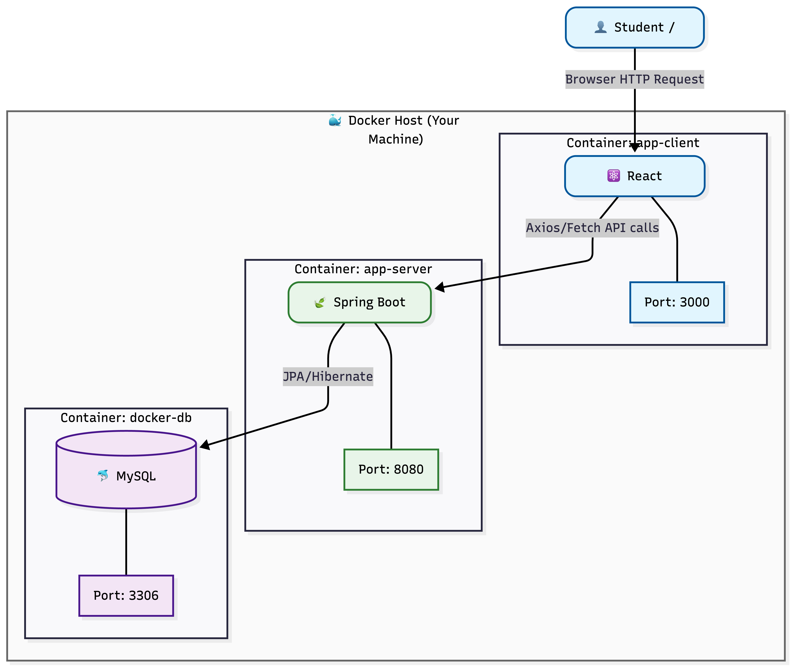
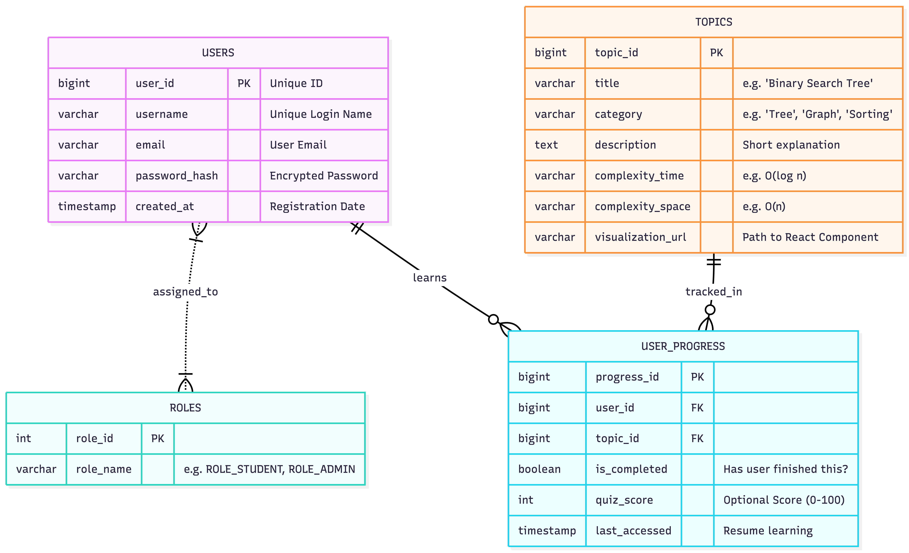
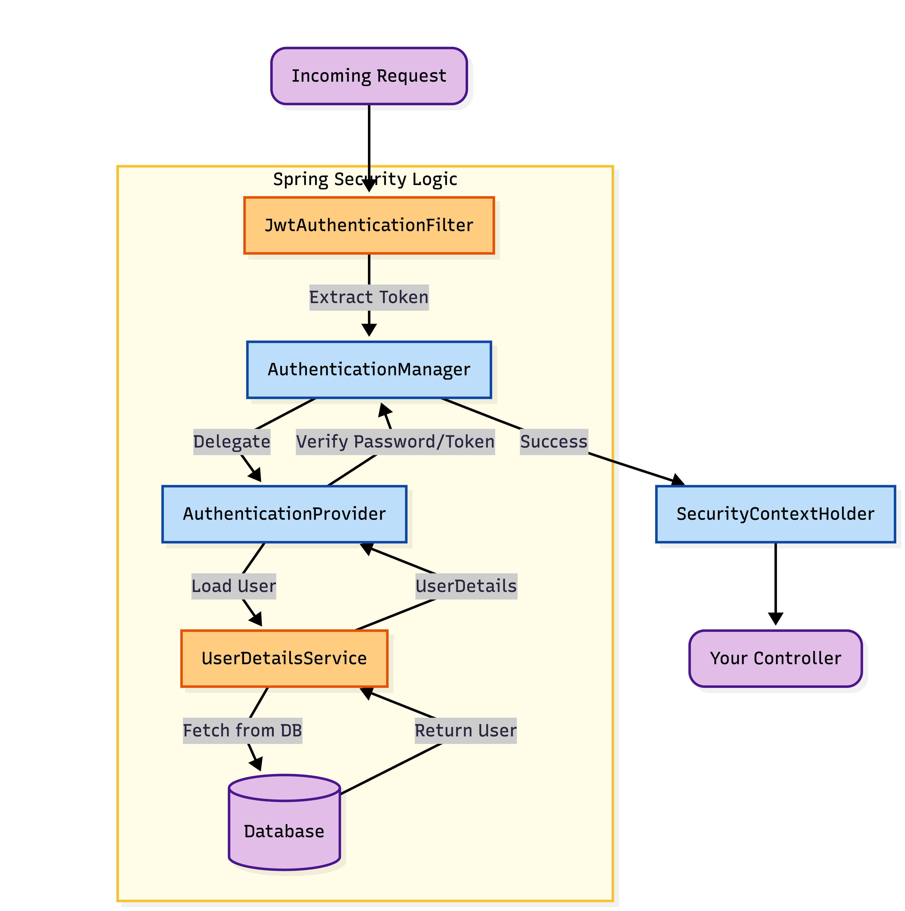

# 🚀 Structify.io - Interactive Data Structure Visualization


<div align="center">

[](https://www.oracle.com/java/)
[](https://spring.io/projects/spring-boot)
[](https://reactjs.org/)
[](https://www.mysql.com/)
[](https://www.docker.com/)

</div>

---

## 📖 Abstract
**Structify.io** is a comprehensive educational platform designed to help students and developers visualize, understand, and master Data Structures and Algorithms (DSA). By bridging the gap between theoretical concepts and visual execution, Structify.io makes complex algorithms intuitive and engaging.

Unlike static textbooks, Structify.io offers **interactive visualizations**, complexity analysis, and real-time progress tracking, powered by a robust **Spring Boot** backend and a dynamic **React** frontend.

---

## 🎥 Project Demo
See Structify.io in action:


---

## 🏗️ System Architecture & Workflow

### 1. Application Flow
This diagram illustrates the high-level architecture, showing how the React Client communicates with the Spring Boot Backend via REST APIs, running within a containerized Docker environment.



### 2. Database Design (ER Diagram)
We use a normalized relational schema to manage Users, Data Structure Topics, and Learning Progress efficiently.



### 3. Security Architecture
Security is paramount. We implemented **Stateless Authentication** using **JWT (JSON Web Tokens)**. This diagram details how the `JwtAuthenticationFilter` intercepts requests to validate identity before reaching protected resources.



---

## 🛠️ Tech Stack

| Component | Technology | Description |
| :--- | :--- | :--- |
| **Backend** | Java 17, Spring Boot | RESTful API, Business Logic, Security |
| **Frontend** | React.js, Tailwind CSS | Interactive UI, State Management |
| **Database** | MySQL | Relational Data Storage |
| **Security** | Spring Security, JWT | Role-Based Access Control (RBAC) |
| **DevOps** | Docker, Docker Compose | Containerization & Easy Deployment |

---

## ⚡ Getting Started

Follow these steps to set up the project locally.

### Prerequisites
* Docker Desktop installed & running
* Git

### Installation

1.  **Clone the repository**
    ```bash
    git clone [https://github.com/Prahlad-07/Structify.io-.git](https://github.com/Prahlad-07/Structify.io-.git)
    cd Structify.io-
    ```

2.  **Run with Docker Compose**
    The entire application (Frontend + Backend + Database) is containerized. simply run:
    ```bash
    docker-compose up --build
    ```

3.  **Access the Application**
    * **Frontend:** `http://localhost:3000`
    * **Backend API:** `http://localhost:8080`
    * **Database:** `localhost:3306`

---

## 🌟 Key Features
* **Interactive Visualizations:** Step-by-step animation of algorithms (Sorting, Trees, Graphs).
* **Role-Based Access:** Admin panel for managing content; Student dashboard for tracking progress.
* **Complexity Analysis:** Real-time Big-O time and space complexity display.
* **Secure Authentication:** JWT-based login and signup system.

---

## 🤝 Contributing
Contributions are what make the open-source community such an amazing place to learn, inspire, and create. Any contributions you make are **greatly appreciated**.

1.  Fork the Project
2.  Create your Feature Branch (`git checkout -b feature/AmazingFeature`)
3.  Commit your Changes (`git commit -m 'Add some AmazingFeature'`)
4.  Push to the Branch (`git push origin feature/AmazingFeature`)
5.  Open a Pull Request

---

## 📞 Contact

**Prahlad Yadav** - [GitHub Profile](https://github.com/Prahlad-07)

Project Link: [https://github.com/Prahlad-07/Structify.io-](https://github.com/Prahlad-07/Structify.io-)
