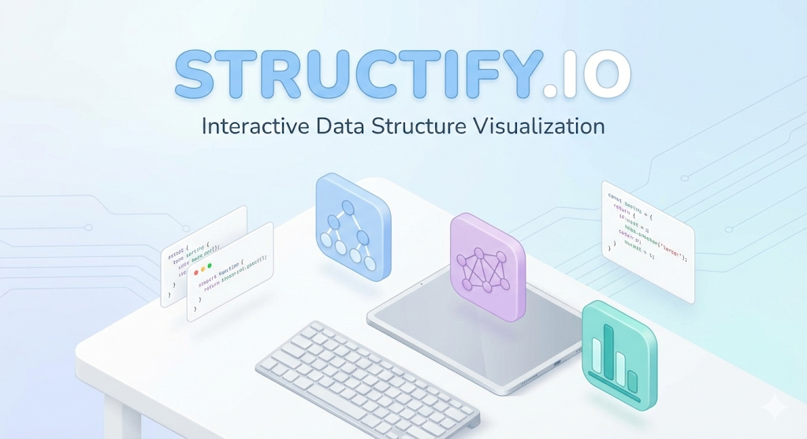

<a name="readme-top"></a>

<div align="center">
  <a href="https://github.com/Prahlad-07/Structify.io-">
    
  </a>

  <h1 align="center">Structify.io</h1>

  <p align="center">
    <strong>Master Data Structures & Algorithms through Interactive Visualization</strong>
    <br />
    <br />
    <a href="http://localhost:3000">View Demo</a>
    ·
    <a href="https://github.com/Prahlad-07/Structify.io-/issues">Report Bug</a>
    ·
    <a href="https://github.com/Prahlad-07/Structify.io-/pulls">Request Feature</a>
  </p>

<p align="center">
  <a href="https://www.oracle.com/java/">
    
  </a>
  <a href="https://spring.io/projects/spring-boot">
    
  </a>
  <a href="https://reactjs.org/">
    
  </a>
  <a href="https://www.mysql.com/">
    
  </a>
  <a href="https://www.docker.com/">
    
  </a>
</p>
</div>

---

<details>
  <summary><strong>📚 Table of Contents</strong></summary>
  <ol>
    <li><a href="#-about-the-project">About The Project</a></li>
    <li><a href="#-system-architecture">System Architecture</a></li>
    <li><a href="#-tech-stack">Tech Stack</a></li>
    <li><a href="#-getting-started">Getting Started</a></li>
    <li><a href="#-key-features">Key Features</a></li>
    <li><a href="#-contributing">Contributing</a></li>
    <li><a href="#-contact">Contact</a></li>
  </ol>
</details>

---

## 📖 About The Project



**Structify.io** is a comprehensive educational platform designed to bridge the gap between theoretical Data Structures and Algorithms (DSA) concepts and visual execution. 

Unlike static textbooks, Structify.io offers **interactive visualizations**, complexity analysis, and real-time progress tracking. It is built for students, developers, and educators who want to visualize code execution in real-time.

---

## 🏗️ System Architecture

Our architecture is designed for scalability and separation of concerns.

### 1. Application Flow
The React Client communicates with the Spring Boot Backend via REST APIs, all orchestrated within a Docker environment.
<div align="center">
  
</div>

### 2. Database Design (ER Diagram)
We use a normalized relational schema to manage Users, Data Structure Topics, and Learning Progress efficiently.
<div align="center">
  
</div>

### 3. Security Flow (JWT)
Requests are intercepted by the `JwtAuthenticationFilter` to validate identity before reaching protected resources.
<div align="center">
  
</div>

---

## 🛠️ Tech Stack

| Domain | Technology | Purpose |
| :--- | :--- | :--- |
| **Backend** | Java 17, Spring Boot 3.0 | Core business logic & REST API |
| **Frontend** | React.js, Tailwind CSS | Responsive & Interactive UI |
| **Database** | MySQL 8.0 | Relational Data Persistence |
| **Security** | Spring Security, JWT | Authentication & Authorization |
| **DevOps** | Docker, Docker Compose | Containerization & Orchestration |

---

## ⚡ Getting Started

You can run Structify.io using Docker (recommended) or manually set it up in your local environment.

### Prerequisites
* **Docker Desktop** (for containerized setup)
* **Java 17 SDK** & **Maven** (for manual setup)
* **Node.js 18+** (for manual setup)

### 🐳 Option 1: Run with Docker (Recommended)

1.  **Clone the repository**
    ```bash
    git clone [https://github.com/Prahlad-07/Structify.io-.git](https://github.com/Prahlad-07/Structify.io-.git)
    cd Structify.io-
    ```

2.  **Start the services**
    ```bash
    docker-compose up --build
    ```

3.  **Access the App**
    * Frontend: [http://localhost:3000](http://localhost:3000)
    * Backend API: [http://localhost:8080](http://localhost:8080)

### ⚙️ Option 2: Manual Setup

<details>
<summary>Click to expand manual instructions</summary>

1.  **Database:** Start MySQL and create a database named `structify_db`.
2.  **Backend:**
    ```bash
    cd backend
    mvn clean install
    mvn spring-boot:run
    ```
3.  **Frontend:**
    ```bash
    cd frontend
    npm install
    npm start
    ```
</details>

---

## 🌟 Key Features
* **Interactive Visualizations:** Step-by-step animation of algorithms (Sorting, Trees, Graphs).
* **Role-Based Access:** Admin panel for managing content; Student dashboard for tracking progress.
* **Complexity Analysis:** Real-time Big-O time and space complexity display.
* **Secure Authentication:** JWT-based login and signup system.

---

## 🤝 Contributing

Contributions are what make the open-source community such an amazing place to learn, inspire, and create. Any contributions you make are **greatly appreciated**.

1.  Fork the Project
2.  Create your Feature Branch (`git checkout -b feature/AmazingFeature`)
3.  Commit your Changes (`git commit -m 'Add some AmazingFeature'`)
4.  Push to the Branch (`git push origin feature/AmazingFeature`)
5.  Open a Pull Request

---

## 📞 Contact

**Prahlad Yadav** - [GitHub Profile](https://github.com/Prahlad-07)

Project Link: [https://github.com/Prahlad-07/Structify.io-](https://github.com/Prahlad-07/Structify.io-)

<p align="right">(<a href="#readme-top">back to top</a>)</p>
